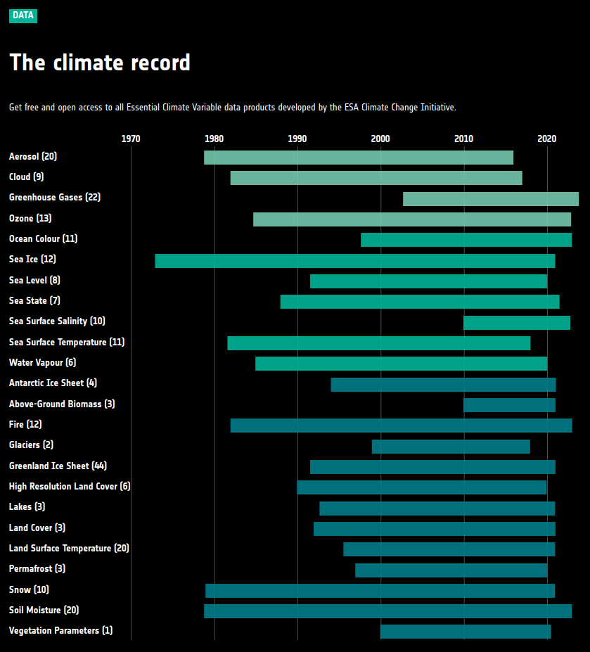
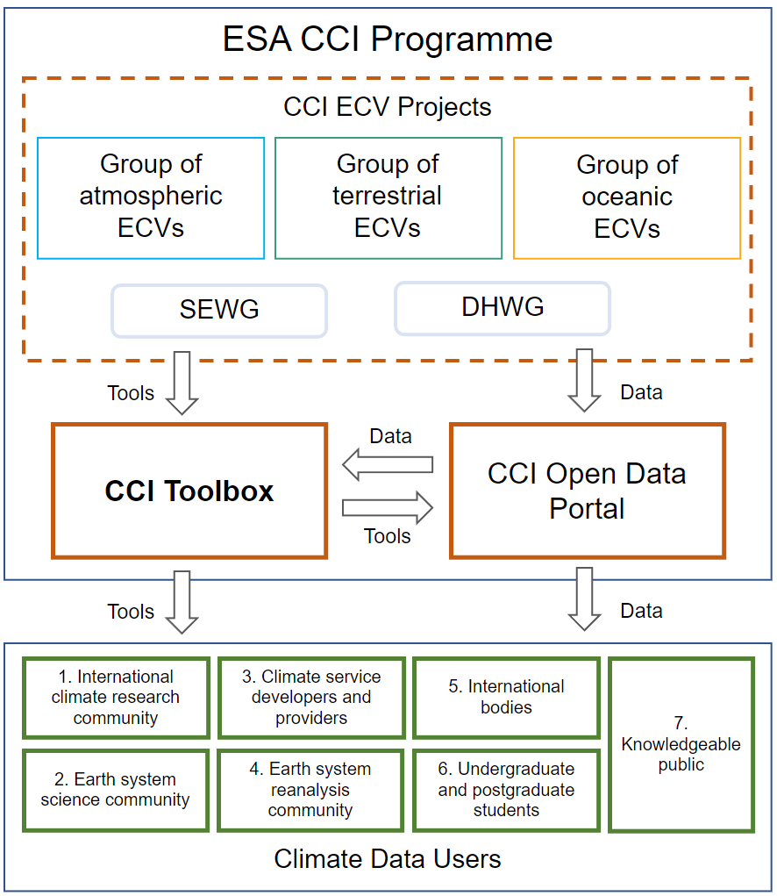

.. _European Space Agency: http://www.esa.int/ESA
.. _Climate Change Initiative: https://climate.esa.int/en/
.. _GCOS: https://gcos.wmo.int/en/home
.. _UNFCCC: http://unfccc.int/2860.php
.. _ECVs: https://climate.esa.int/en/projects/
.. _CCI Open Data Portal: https://climate.esa.int/en/odp/#/dashboard

============
Introduction
============

Project Background
==================

In 2009 the `European Space Agency`_ launched the
`Climate Change Initiative`_ (CCI), a programme to respond to the need for
climate-quality satellite data as expressed by GCOS_, the Global Climate
Observing System that supports the UNFCCC_, the United Nations Framework
Convention on Climate Change.

In the ESA CCI programme **Essential Climate Variables** (ECVs_) are produced
by individual expert teams, and cross-cutting activities provide coordination,
harmonisation and support. The **CCI Toolbox** and the `CCI Open Data Portal`_
are the two main technical support projects within the programme.
The CCI Open Data Portal provides a single point of harmonised access to a
subset of mature and validated ECV-related data products.

.. _odp_:

   Snapshot from `CCI Open Data Portal`_ with some of the available ECVs
The CCI Toolbox provides tools that support visualisation, analysis and
processing across CCI and other climate data products.
With these two technical cross-cutting activities ESA is providing an interface
between its CCI projects and the ECVs generated there, and the wider climate
change user community.

.. _toolbox-context:

   CCI Toolbox context

Key Objectives
==============

The four key objectives of the CCI Toolbox are:

* Provide to climate users an intuitive software application that is capable of
  **ingesting data from all CCI projects** and synergistically use this data in
  a uniform tooling environment.
  This requires the application to abstract from the various data types used to
  represent the different ECVs (vector data, n-D raster data), and from data
  formats used (NetCDF, Shapefiles), and also from various data sources
  (remote services, local files).
* Provide to users a rich set of **data processing operations** that implement
  commonly used climate algorithms. Processors can be used to build processing
  chains that represent typical climate workflows.
* Provide to users various **visualisation and analysis** operations.
  The majority of visualisation and analysis functions are applicable to
  multiple ECVs while others may only work if certain constraints are met. Some
  of these functions may be implemented as processors and be used in processing
  chains.
* Provide the **architecture** of the CCI Toolbox so that it **can be extended**
  **by new climate operations** and that it also allows for **reuse of**
  **existing or planned software tools and libraries**. Furthermore allow other
  scientists and tool developers to use the underlying CCI Toolbox algorithms
  and libraries in their own programs.
